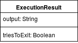
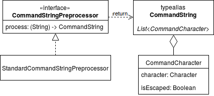
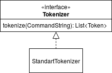
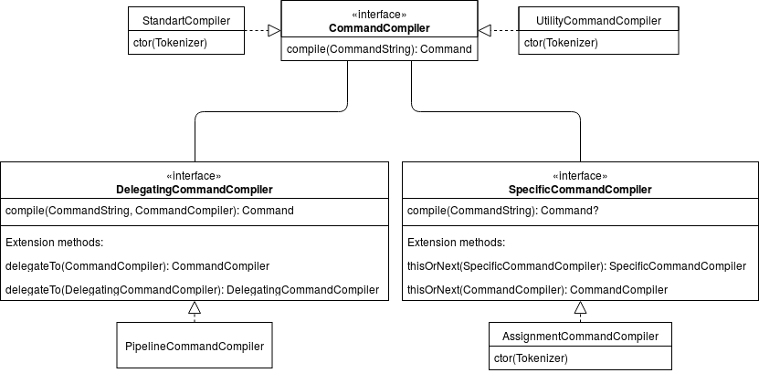
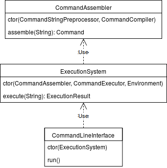

# Описание

## Синтаксис и семантика

Символ является **экранируемым**, если он находится внутри пары двойных `""` или одинарных `''` кавычек. Кавычки тоже можно экранировать, заключив их внутри кавычек другого типа. Единственное отличие двойных кавычек заключается в том, что они не экранируют символ `$`.

**Окружением** (*Environment*) называется набор именованных утилит и пар (имя, значение). Окружение может меняться по ходу исполнения команд.

**Атомарной командой** (*Atomic Command*) называется команда, которая использует ровно одну именованную утилиту или которая является командой присваивания. Примерами таких команд являются: `echo "Hi"`, `pwd`, `val = 42`.

Атомарные команды можно комбинировать между собой с помощью различных операций в **сложные команды**. На данный момент в требованиях указана лишь одна такая операция &mdash; *pipe*.

На первом этапе своей работы интерпретатор использует все неэкранируемые символы `|`, чтобы разбить входную строку на последовательность атомарных команд, которые образуют *pipeline*.

Далее идет обработка атомарной команды. Если внутри атомарной команды нет неэкранируемого символа `=`, то команда считается вызовом именованной утилиты. Вся строка разбивается на последовательность **токенов** (*Token*), разделителями являются неэкранируемые [пробельные символы](https://stackoverflow.com/a/18169122).

При наличии окружения токен можно вычислить в строку. Для этого все последовательности, начинающиеся с неэкранируемого символа `$`, вида `$NAME` заменяются на значение для имени `NAME` из окружения. При этом такая последовательность заканчивается в том месте, где следующий символ один из перечисленных: `$`, `'`, `"`, пробельный символ, `EOL`.

В получившейся последовательности строк первая строка является именем утилиты, все последующие &mdash; аргументами.

Если внутри атомарной команды есть неэкранируемый символ `=`, то команда считается командой присваивания. Первый из таких символов `=` разбивает строку на две части. Обе части должны быть единичными токенами, в противном случае команда считается невалидной. Первая часть вычисляется в имя, вторая часть в значение. Сама команда добавляет данную пару в окружение. Если данное имя уже было ассоциировано со значением, то значение перезаписывается.

## Архитектура

Результатом выполнения команды является объект типа `ExecutionResult`. Результат выполнения команды представляет из себя текстовый вывод команды и флаг, который означает нужно ли завершать сеанс.

 

Абстракцией для команды-утилиты (именованная команда) является интерфейс `Utility`. Утилита для своего исполнения принимает аргументы и содержимое входного потока.

Окружение задается классом `Environment`.

Интерфейс `Token` представляет из себя строку, которая может быть получена только при наличии окружения.

А абстракцией для команды, которая может быть скомбинирована с другими и выполнена в некотором окружении, является интерфейс `Command`.

Для команд сделан интерфейс `Visitor`. А интерфейс `CommandExecutor` может исполнять команды.

 

***

Объекты класса `CommandCharacter` представляют из себя обычные символы, с одним лишь отличием, что некоторые из них могут быть экранированными.

Тип `CommandString` представляет из себя "строку" из `CommandCharacter`.

Абстракцией для объекта, который может преобразовывать строку в `CommandString` является интерфейс `CommandStringPreprocessor`.

`StandartCommandStringPreprocessor` &mdash; стандартный `CommandStringPreprocessor`.

 

***

`Tokenizer` &mdash; интерфейс для объектов, которые разбивают `CommandString` на последовательность токенов.

 

***

Интерфейс `CommandCompiler` является абстракцией над объектами, которые могут по обработанной препроцессором строке получать команду. Одним из таких объектов является `UtilityCommandCompiler`, который разбивает строку на токены и интерпретирует их как вызов команды утилиты. Другим таким объектом является `StandartCompiler`, который целиком разбирает строку и создает команду согласно правилам, описанным в предыдущем разделе.

`DelegatingCommandCompiler` похож на `CommandCompiler`, но для полноценного создания команды таким объектам нужен другой `CommandCompiler`, которому будет делегирована часть процесса создания команды. Таким объектом является `PipelineCommandCompiler`, который разбивает строку на последовательность команд, каждая из которых должна быть разобрана другим `CommandCompiler`.

`SpecificCommandCompiler` пытается разобрать специфичную команду, которую возможно и не получится разобрать. Объектом такого типа является `AssignmentCommandCompiler`, который пытается разобрать команду присваивание.

У `DelegatingCommandCompiler` и `SpecificCommandCompiler` есть специальные расширяющие методы, которые позволяют комбинировать их с другими компиляторами.

 

***

`CommandAssembler` объединяет препроцессинг строки и компиляцию обработанной строки в команду.

`ExecutionSystem` хранит текущее состояние окружения и позволяет исполнять команды, которые передаются в виде строк.

`CommandLineInterface` &mdash; консольный REPL интерфейс для исполнения команд.

 
